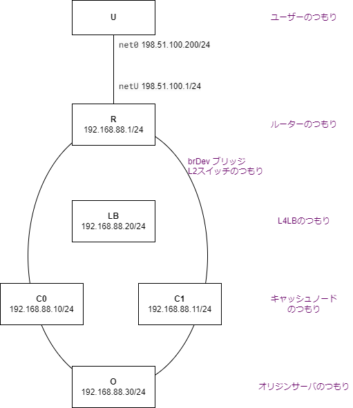

# 事前課題
セキュリティキャンプ現地講義前の学習に役立てていただきたく、事前課題を用意しています。奮ってご参加ください。

## 事前課題-1
課題提出管理スプレッドシートへの書き込みアクセス権限を得て、自分の名前もしくはハンドルネームと、
確認した旨を記入してください。以後の課題提出は、こちらのスプレッドシートを用いて行います。

## 事前課題0
このレポジトリをforkし、forkしたGitHubレポジトリのURLを課題提出管理スプレッドシート上で通知してください。
GitHubレポジトリはプライベートレポジトリで構いませんが、@yzp0n に読み込み権限を付与願います。

## 事前課題1
「ブラウザのURLバーに、 https://www.shonenjump.com/j/weeklyshonenjump/ を入力して決定キーを押した時になにが起こるか」を調べてください。
調べた結果をまとめ、スプレッドシートにそのURLを記載してください。
講師からフィードバックがやりやすいため、Google Docの利用を推奨します。
LLMを回答に用いた場合は、その旨を申告してください（本課題に関しては、誤った回答をすることを確認しているためです）。

回答には以下の事柄を含んでください:
  - 名前解決について
    - DNSを使った名前解決の動作(DNSリゾルバの動作)について、調べてみてください
    - 最終的に、`shonenjump.com`の権威DNSサーバが受け取るクエリはどのようなものでしょうか
    - だれがこの権威DNSサーバにクエリをなげるのでしょうか
  - イーサネット、IPルーティングについて
    - (仮に、`shonenjump.com`のIPアドレスが`192.0.2.10`だったとします。また、ブラウザを動かしている端末のIPアドレスは、`192.168.0.100`であり、家庭用ルータのIPアドレスが`192.168.0.1`だったとします)
    - 端末は、`192.0.2.10`というIPアドレスを宛先とするIPv4パケットを、ルータに送信します。しかしルータのIPアドレスは`192.168.0.1`です。どうやってルータに送信するんでしょう。
    - `192.168.0.100`発、`192.0.2.10`宛のIPv4パケットを受け取ったルータは、上流のISP(インターネットサービスプロバイダ)にパケットを転送します。しかしそのまま転送すると、ISPルータはこのパケットを破棄してしまうと思います、それはなぜでしょう。ルータは、転送する前に端末から受け取ったIPパケットに対してどういう加工を行いますか。
    - (ISPルータのIPアドレスが`203.0.113.1`, ルータに割り当てられたグローバルIPアドレスが`203.0.113.100`とします)
    - ISPルータは、家庭ルータから受け取ったパケットを、別のルータに向けて転送します。この際、ルータはパケットの加工をおこないますか？おこないませんか？(パケットのヘッダは、ルータが受け取ったパケットとルータが次ルータに送出するパケットで同じでしょうか？)理由とともに述べてください
    - ISPルータは、`192.0.2.10`サーバに直接繋がっておりません。複数のルータを経由して、最終的に`192.0.2.10`へパケットが到達します。また、ISPルータは、複数のルータと相互接続していると思います。どのルータにパケットを転送するか、どう決めているんでしょう。
  - TCPについて
    - （山本先生のN6講義「TCP/IPプロトコルスタック自作」の事前課題を通じて学んでいただければと思います）
    - 本講義で必要とされる知識としては、TCPフラグ値のLSB3bitの意味やTCPチェックサムの計算範囲ぐらいを確認いただければ大丈夫です
  - TLSについて（今回、演習で作るCDNはTLS非対応としますので、ざっくりで大丈夫です）
  - HTTPについて
    - (`shonenjump.com`はHTTP 1.0のみに対応したWebサーバとします)
    - ブラウザは、どのようなHTTPリクエストをWebサーバに送信するでしょうか
    - Webサーバは、どのようなHTTPレスポンスをクライアント（ブラウザ）に返すでしょうか
  - HTTPレスポンスを受け取ったあとのブラウザの挙動について（今回の演習の範囲外となりますので、ざっくりで結構です

## 事前課題2: GSLB 環境構築

#### devcontainer環境構築
VSCode コマンドパレットで"Reopen in Container"コマンドを実行し、Devcontainer内で開発ができることを確認してください。

#### レポジトリ外配布 Corefile の入手
講師に連絡して、演習環境にアクセスするための`Corefile`を入手して、workspace 内に配置してください。
このファイルは、あまり積極的に公開したいものではないので、**公開GitHubレポジトリで公開することは避けてください**。

`./secrets/`ディレクトリが`.gitignore`設定により git 管理対象外になっているので、こちらを活用するか、Devcontainerの`mount`設定を活用してホスト別ディレクトリに置く、などの手段があると思います。

#### GSLB プログラムを動かしてみる
VSCodeでターミナルを開くと、devcontainer内環境のbashが立ち上がると思います。こちらで、
* `go get -v ./...` と入力すると依存モジュールがダウンロードできます。
* `go run ./gslb/gslb-coredns -conf [別途配布されたCorefileへのパス]` を実行すると、CoreDNSサーバが立ち上がります。
* http://localhost:8853 にお手元のブラウザでアクセスすると、可視化WebUIが立ち上がると思います。
   * うまく動作しない場合は、8853 TCPポートがポートフォワードされているかご確認ください。

#### dig コマンドでクエリを投げてみる
* corednsサーバを動作させたまま、別ターミナルを開き、`dig www.ncdn.example @127.0.0.1 -p 10053`コマンドを実行すると、GSLBプログラムにDNSクエリが投げられます。`status: NOERROR`と表示され、何らかの結果が返ってくることを確認してください。

#### 当日課題ネタバレ
当日の講義では、`gslb/gslbcore/core.go`内の`func (c *GslbCore) Query(srcIP netip.Addr) []netip.Addr`をいい感じに実装してもらおうと思っています。
ただ、興味がある人は講義を待たずにアルゴリズムを作り込みたいと思いますので、ぜひ挑戦してみてください。

* 基本挙動の確認
    * Query関数の戻り値は、クライアントにAレコードとして応答されます。適当なアドレスを返すようにプログラムを書き換えて、これを確認してみてください。
    * `dig www.ncdn.example @127.0.0.1 -p 10053 +subnet=167.99.111.33/32`とすると、DNSサーバにクライアントのsubnetを通知することができます。[[RFC7871](https://datatracker.ietf.org/doc/html/rfc7871)]。`Query`関数にこの情報が通知されていることをログで確認してください。
* シンプルなアルゴリズムの検討・実装
    * `c.regions`には、その地域のIPアドレス範囲と、プローブから計測したPoPへのRTT情報が収められています。これを活用して、地域から一番RTTが短いPoPのIPアドレスを返すように、Query関数を書いてみてください。
* より良いアルゴリズムを提案してください。また、可能であればそれを実装してみてください。

## 事前課題3: L4LB 環境構築

#### devcontainer 環境構築
事前課題2配布以降、devcontainer 環境ファイルを更新しています。
`git pull`後、VSCode 上で`DevContainer: Rebuild Container`を実行し、BPF開発環境を含む、最新版の devcontainer 環境に更新してください。

#### netns 模擬環境構築
`cd l4lb; sudo ./netns_setup.sh`を実行すると、下図のようなネットワークが`netns`コンテナを用いて構築されます。

* `netns_setup.sh`の中身を読んで、どうやってこのようなネットワークを構築しているか調べてみてください。
* `netns`内の Linux ネットワーク設定を変更するには `ip -n [netns名] route show`のように、iproute2 のipコマンド[[man ip(8)](https://man7.org/linux/man-pages/man8/ip.8.html)]に用意されている`-n`コマンドライン引数が使えます。図のようなネットワークが構築できているかどうか、確認してみましょう。
    * `ip -n [netns名] a`を実行して、割り当てられている IP アドレスを確認してみてください
    * `ip -n [netns名] r get [別netnsのIPアドレス]`を実行して、nexthop を確認してみてください
* Linux プロセスを指定`netns`内で立ち上げるには`ip netns exec`が便利です。`sudo ip netns exec [netns名] [コマンド...]`という形で使えます。
    * `sudo ip netns exec [netns名] ping [別netnsのIPアドレス]`を実行して、ICMP pingが到達可能なことを確かめてみてください

#### 模擬キャッシュサーバ、オリジンサーバの起動
別ターミナルを開き、`cd l4lb; ./run-be.sh`を実行すると、模擬キャッシュサーバ、オリジンサーバがそれぞれ`C0, C1, O` netns内で立ち上がります。

http://localhost:9002 をブラウザで開くと、これらのプロセスが管理される supervisord の WebUI にアクセスできます。

#### L4LBの起動
さらに別ターミナルを開き（キャッシュサーバ、オリジンサーバを立ち上げたままで）`cd l4lb; ./run-lb.sh`を実行すると、L4LBが起動します。

#### 動作確認
* `C0`→`O` 疎通確認
    * `sudo ip netns exec C0 curl http://192.168.88.30:8888/json`
* `C0` キャッシュサーバが動いていることを確認
    * `sudo ip netns exec C0 curl http://192.0.2.10:8889/statusz`
* `U` ユーザからキャッシュサーバにL4LBを介して到達できることを確認
    * `sudo ip netns exec U curl http://192.0.2.10:8889/statusz`

#### パケットキャプチャを見る
どんなパケットが流れているかを見てみましょう。

* `U⇔R`間トラフィックをキャプチャ
    * `sudo ip netns exec R tcpdump -vvv -ni netU`
* `brDev`ブリッジ（仮想L2スイッチ）トラフィックをキャプチャ
    * `sudo tcpdump -vvv -ni brDev`

`tcpdump -w [pcapファイル名]`とすると、パケットキャプチャをpcapファイルとして書き出すことができます。このファイルをwiresharkで開くと、より詳細な情報が見やすいかもしれません。
